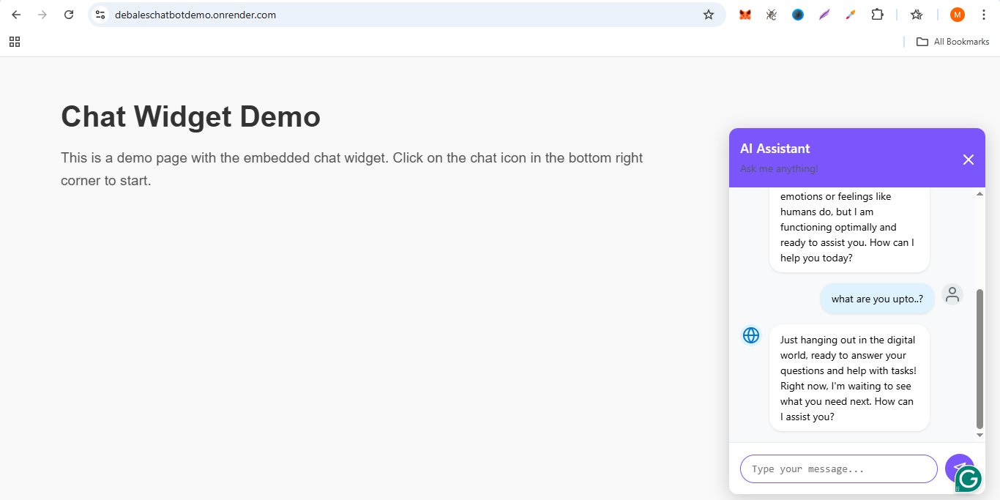

# Project Title

## Description
This project includes a chatbot and a dashboard. The chatbot provides interactive responses to user queries, while the dashboard allows users to monitor and manage data visually.

## Features
- **Chatbot**: Interactive and user-friendly chatbot for handling queries.
- **Dashboard**: A graphical interface to monitor and manage data.
- **Customizable**: Easily configurable for different use cases.
## Live Demo
- **ChatBot**: [Click here](https://debaleschatbotdemo.onrender.com/)
- **Dashboard**: [Click here](https://debalesdashboard.vercel.app/)
  

## Installation
1. Clone the repository:
   ```bash
   git clone <repository-url>
   ```
2. Navigate to the project directory:
   ```bash
   cd <project-directory>
   ```
3. Install dependencies:
   ```bash
   npm install
   ```
4. Set up environment variables:
   - Create a `.env` file in the root directory.
   - Add the required variables (e.g., API keys, database credentials).
   - Note:- do look for chat-bot [chatwidget.js] and dashboard env and change supabase and gemini ai credentials
   - at frontend do make two .env files in format
   - env
```PORT=3000
SUPABASE_URL=---------------
SUPABASE_SERVICE_KEY=--------------
GEMINI_API_KEY=-----------
```
   - exchange the credentails in frontend
## Usage

### Running the Chatbot
1. Start the chatbot server:
   ```bash
   npm nodemon server
   ```
   (*server should run on PORT:3000*)
2. Then Open Index.html , you get a demo page to access the bot

### Running the Dashboard
1. Enter dashboard:
   ```bash
   cd dashboard
   ```
2. Install all dependenceries:
   ```bash
   npm i
   ```
3. Start the dashboard server:
   ```bash
   npm run dev
   ```

4. Open the dashboard in your browser (e.g., `http://localhost:4000`).

## How to Embed
To embed the chatbot widget into your webpage, include the following script in your HTML file. Replace the credentials with your actual values:

```html
<script src="/chat-widget.js"></script>
<script>
    document.addEventListener('DOMContentLoaded', function() {
        initChatWidget({
            geminiApiKey: window.ENV.GEMINI_API_KEY, 
            supabaseUrl: window.ENV.SUPABASE_URL,
            supabaseKey: window.ENV.SUPABASE_SERVICE_KEY,
            socketIoUrl: '', // e.g., 'http://localhost:3000'
            widgetTitle: 'AI Assistant',
            widgetSubtitle: 'Ask me anything!',
            primaryColor: '#7857fe'
        });
    });
</script>
```

## Screenshots

### Chatbot  


### Dashboard  


## Contact
For any questions or feedback, please contact [samuneeb786@example.com].
